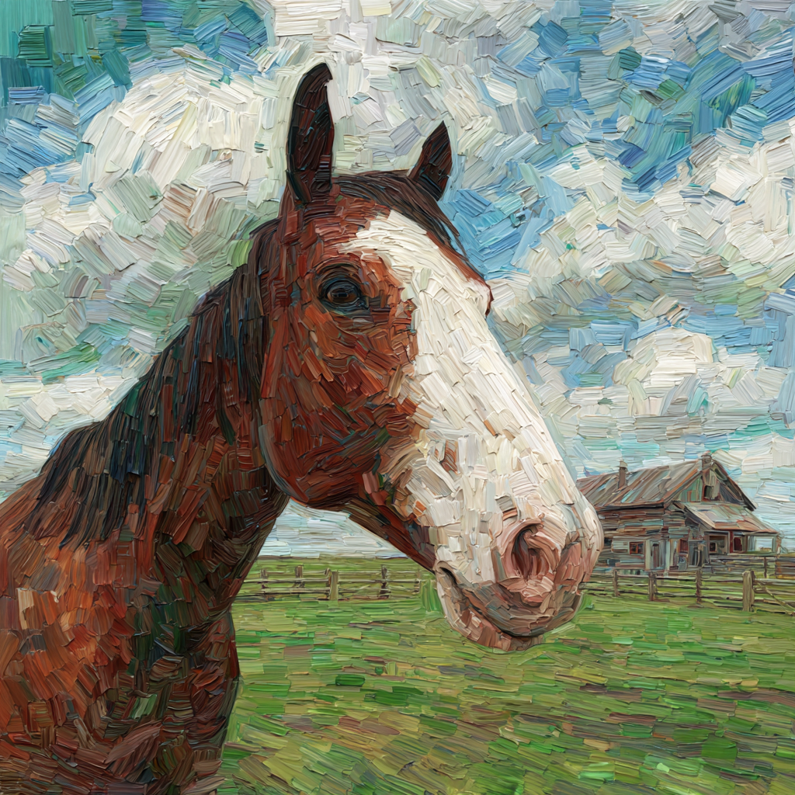

# The Triple Treat

<p align="center">
  
</p>

A curated word list blending traditional vocabulary, modern slang, IKEA furniture names and brands.
## Table of Contents
- [Overview](#overview)
- [Sources](#sources)
- [Processing Summary](#processing-summary)
- [Final Dictionary](#final-dictionary)
- [Word Distribution](#word-distribution)
- [Usage](#usage)
- [Preview the README Locally](#preview-the-readme-locally)

## Overview
I made a dictionary. You're welcome. The goal was to create an interesting, memorable, and substantial set of words that can be used for things like passphrases, naming, and creative prompts.

## Sources
I pulled data from four sources to mix styles and contexts: a standard dictionary, Urban Dictionary, IKEA product names, and top brands.

### 1) Standard Dictionary
- **Source**: Public domain English word list
- **Original size**: 370,105 words
- **Processing**: Filtered to keep only words with 11+ characters
- **Result**: 84,103 substantial words
- **Quality**: Traditional English vocabulary, academic terms, technical words

### 2) Urban Dictionary
- **Source**: Urban Dictionary dataset (1999–2016)
- **Original size**: 765,772 entries (1.9 GB JSON)
- **Processing**:
  - Extracted unique words from JSON entries
  - Filtered to 3–20 character words
  - Removed duplicates
  - Further filtered to 11+ character words
- **Result**: 77,698 modern slang words
- **Quality**: Contemporary internet slang, memes, modern vocabulary

### 3) IKEA Product Names
- **Source**: IKEA product naming database
- **Original size**: 1,385 product entries
- **Processing**:
  - Extracted product names from metadata
  - Removed special characters and descriptions
  - Converted to lowercase
  - Filtered to 3–20 character names
- **Result**: 1,360 unique product names
- **Quality**: Swedish/Scandinavian names, international place names, distinctive vocabulary

### 4) Brand Names
- **Source**: List aggregated with assistance from GPT

## Processing Summary
High-level steps used across sources:
- Parse and extract candidate tokens
- Normalize case and strip special characters
- Remove duplicates
- Filter by length (focus on 11+ characters for substantial words)

## Final Dictionary
- **Combined file**: `data/words.txt` (≈2.3 MB)
- **Total words**: 160,287 unique words
- **Word quality**: 99.2% are 11+ characters long
- **Vocabulary mix**: Traditional, modern slang, and international names

## Word Distribution

| Length bucket | Share |
| --- | --- |
| 12–13 chars | 62.6% |
| 14–16 chars | 29.8% |
| 17+ chars | 6.8% |
| 3–10 chars | 0.8% |

This creates a diverse vocabulary perfect for memorable passphrases and creative naming.

## Usage
You can load the word list directly from `data/words.txt` in your language of choice.

Example (Node.js):

```js
import { readFileSync } from 'node:fs';

const contents = readFileSync('data/words.txt', 'utf8');
const words = contents.split('\n').filter(Boolean);
console.log(words.slice(0, 10));
```

Example (Python):

```python
with open('data/words.txt', 'r', encoding='utf-8') as f:
    words = [line.strip() for line in f if line.strip()]
print(words[:10])
```
